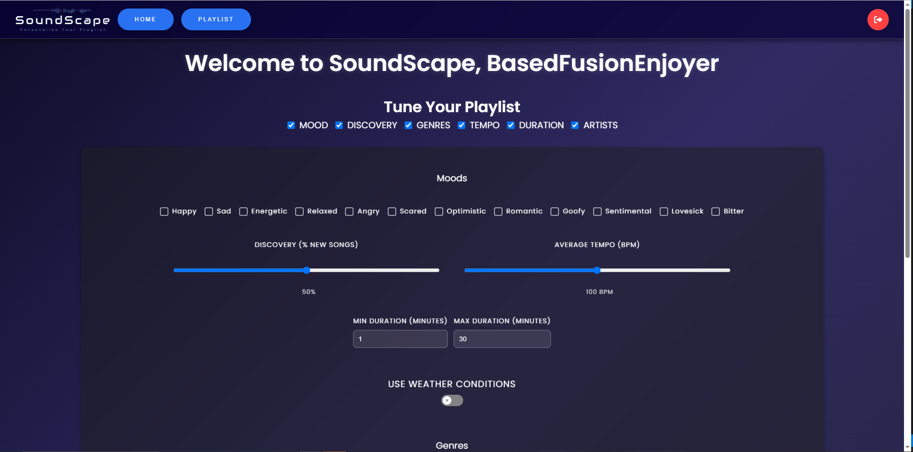
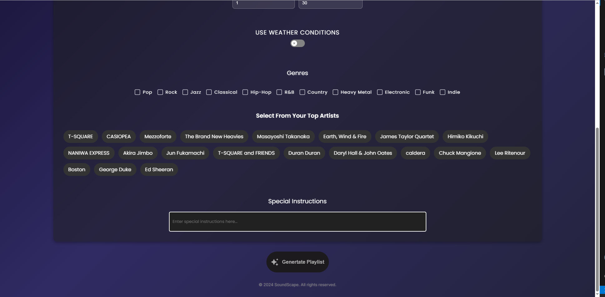
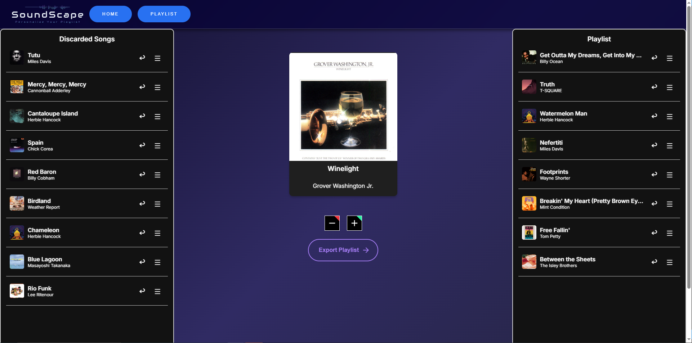
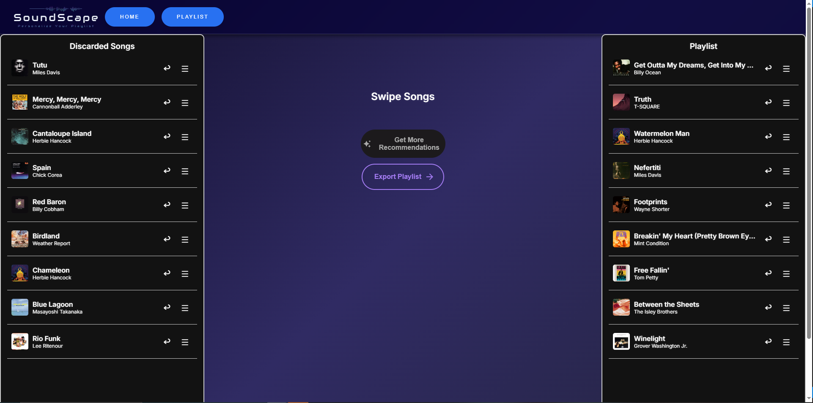

**Note that this application is currently in development, and the steps to run the application and use the application may change frequently as the app is in development. These docs will continue to be updated as the application is developed*

# Steps Before Launch
1. Install all dependencies
    1. First, install [Node.js](https://nodejs.org/en/download) if necessary
    2. Then run *npm install express*, *npm install react*, and *npm i*
3. Obtain the .env file from one of the developers and add this inside the [server](/code/server) folder
4. Have a Spotify associated email address added to the Spotify developer console by an admin

# Steps to Run the Code
*Note: This assumes you have all required packages and dependencies installed. You will need to download node.js, install express, and run npm i in both the code and code/client folders to run the code*
1. Open a terminal and navigate to code/server
2. Run *node server.js*
3. Open another terminal and navigate to code/client
4. Run *npm start*

## To run the python server to access the AI model:
1. Navigate to model/server
2. Run *python server.py*

# Application Running
1. When you run *npm start*, it will launch the application. Otherwise, by default, it will run on port 3000 (while it is still in development) so you can navigate to [localhost:3000](http://localhost:3000) to access the app
2. Log into the application with the credentials associated with the email that was entered in the spotify developer console
3. Upon logging in, you will be brought to the home page of the application. Here you may enter any contextual inputs or criteria you are interested in for song generation.
4. Once the criteria is entered, click 'Generate Playlist' at the bottom of the page to begin.

# SoundScape Home Page
1. Top Bar Buttons for Navigation and Testing
    1. Home Button - use this button to navigate to the home page from any other page on the site.
    2. Playlist Button - use this button to navigate to the playlist generation page at any time.
    3. Login/Logout Button - use this button to login or logout of the application whenever necessary.
    4. Generate Playlist Button - use this button to begin the generation process using the currently selected criteria and prompts.
2. Page Fields for Filtering Songs
    1. Top Checkboxes - use these ceckboxes to enable or disable contextual inputs. When deselected, a contextual input will not be used in the generation process.
    2. Mood - use this checkbox selection to choose your current mood(s) for playlist generation
    3. Genres - use this checkbox selection to choose genres to include in the playlist 
    4. Minimum Song Duration - use this to enter the lower bound for song duration filtering
    5. Maximum Song Duration - use this to enter the upper bound for song duration filtering
    6. Discovery % - use this slider to select the amount of songs to generate that are new to you based on Spotify listening habits
    7. Tempo (BPM) - use this slider to select upper and lower bounds for filtering on BPM of songs
    8. Weather Conditions - use this toggle to enable the use of weather conditions in playlist generation
    9. Top Artists - use this selection field to choose from your current top artists to include them in the playlist generation
    10. Special Instructions - use this text input to write any special instructions for the AI model to take into account when generating recommendations
    11. Generate Playlist - use this button to begin the song generation process once all desired filters are entered

# SoundScape Playlist Page
1. Swipe Box - Recommended songs will appear in the swipe box in the middle of the page. Click and drag the song image to the right to add it to the current playlist. Click and drag the song to the left to add the song to the discard list.
2. Playlist - The current list of selected songs will appear in the 'Playlist' section as they are swiped from the center swipe box. Songs in the 'Playlist' section can be re-arranged using the drag handles, or reshuffled to the center using the reshuffle button.
3. Discarded Songs - The current list of discarded songs will appear in the 'Discarded Songs' section as they are swiped from the center swipe box. Songs in the 'Discarded Songs' section can be re-arranged using the drag handles, or reshuffled to the center using the reshuffle button.
4. Plus / Minus Buttons - The plus and minus buttons can be used to achieve the same result as swiping the songs left or right with the cursor. Plus will add the song to the Playlist, and Minus will add the song to the discard list.
5. Export Playlist - The export playlist button will display a pop up box prompting the user to enter a name for their playlist and a back button option, or a submit button option. On submission, the user will recieve a message confirming that the playlist has been successfully exported to their Spotify account.
6. Get More Recommendations - When the user has exhausted their recommendations, the Get More Recommendations button will appear. This button allows the user to generate a new round of recommendations and continue adding them to their playlist.

 
 

# FAQ
1. How do I link my Spotify account so I get accurate recommendations? - Login to the app with your spotify credentials and the recommendations will be specific to your listening history.
2. What if I don't want to utilize all filter fields on the home page? - Many of these filter fields will be toggleable so that the user can decide whether or not they want certain fields to be used in playlist generation.
3. What if I want to reshuffle a song back into recommendations if I'm not sure I want it yet? - Use the reshuffle button on the song tiles in the playlist and discard lists.

